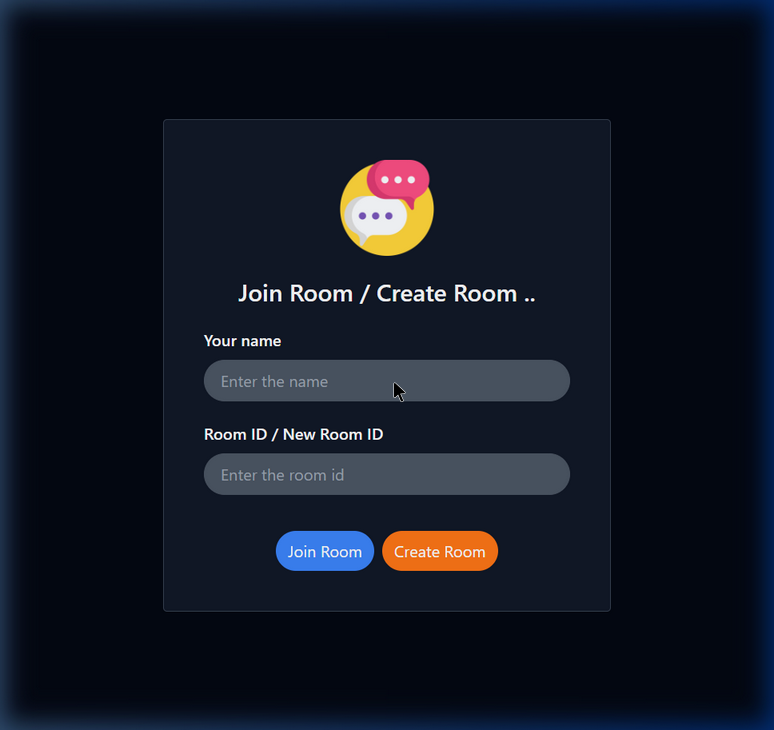
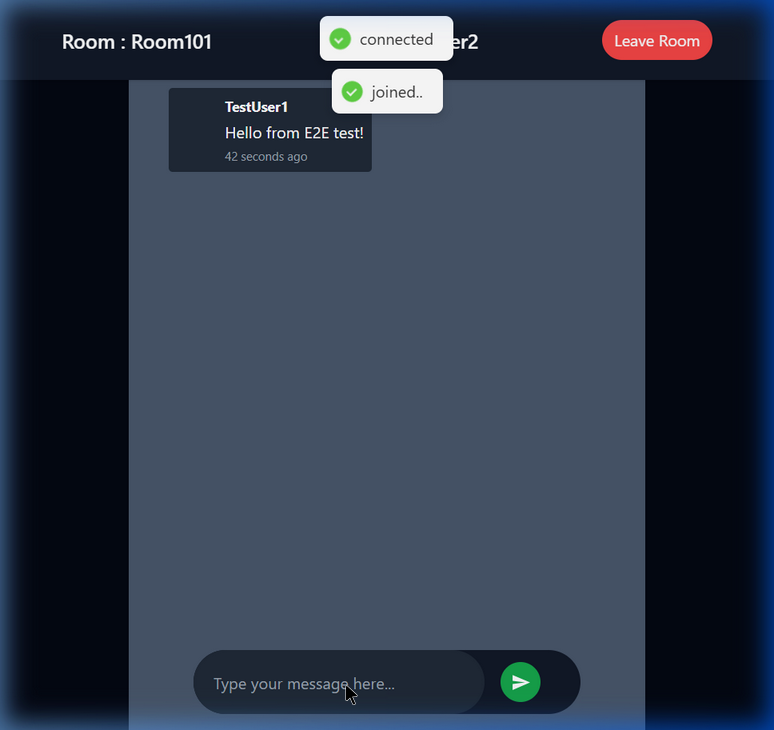

<div align="center">

# 💬 ChatApp

### A Real-Time Group Chat Application

[](https://openjdk.org/)
[](https://spring.io/projects/spring-boot)
[](https://react.dev/)
[](https://www.mongodb.com/)
[](https://stomp.github.io/)
[](https://tailwindcss.com/)

**Real-time messaging · Custom Chat Rooms · Persistent History · Modern UI**

</div>

---

## 📋 Table of Contents

- [Overview](#-overview)
- [Features](#-features)
- [Tech Stack](#-tech-stack)
- [Architecture](#-architecture)
- [Screenshots](#-screenshots)
- [API & WebSocket Reference](#-api--websocket-reference)
- [Local Setup](#-local-setup)
- [Project Structure](#-project-structure)

---

## 🌟 Overview

**ChatApp** is a scalable real-time communication platform built using **Spring Boot** and **WebSocket (STOMP)** for the backend, and **React** for the frontend. It allows users to create custom chat rooms, join them using a unique ID, and exchange messages instantly. Unlike basic chat apps, this project features message persistence using **MongoDB**, ensuring that chat history is available even after refreshing or rejoining.

---

## ✨ Features

| Feature | Description |
|---------|-------------|
| 🚀 **Real-Time Messaging** | Instant message delivery using WebSocket and STOMP protocol. |
| 🏠 **Custom Rooms** | Create or join specific chat rooms using unique Room IDs. |
| 📜 **Message Persistence** | All chats are stored in MongoDB and loaded when joining a room. |
| 🌗 **Modern Dark UI** | Sleek, dark-themed interface built with Tailwind CSS. |
| 🔔 **Live Toasts** | Real-time feedback for connection status, room creation, and errors. |
| 📱 **Responsive Design** | Optimized for various screen sizes. |

---

## 🛠️ Tech Stack

### Backend
- **Java 21**
- **Spring Boot 3.4** (Web, WebSocket, Data MongoDB)
- **Spring Messaging** (STOMP support)
- **MongoDB** (NoSQL Database for fast document storage)
- **Lombok** (Clean code)

### Frontend
- **React 18**
- **Vite** (Build tool)
- **Tailwind CSS** (Styling)
- **SockJS & StompJS** (WebSocket client)
- **React Hot Toast** (Notifications)

---

## 🏗️ Architecture

```
┌──────────────────┐          WebSocket (STOMP)         ┌──────────────────┐
│   React Client   │ ◀────────────────────────────────▶ │ Spring Boot App  │
│ (SockJS/StompJS) │                                    │ (Message Broker) │
└────────┬─────────┘                                    └────────┬─────────┘
         │                                                       │
         │ REST API (Room Ops)                                   │ Spring Data
         └───────────────────────────┬───────────────────────────┘
                                     ▼
                          ┌───────────────────────┐
                          │       MongoDB         │
                          │   (Room & Messages)   │
                          └───────────────────────┘
```

---

## 📸 Screenshots

### Join / Create Room


### Real-Time Chat Room


---

## 📡 API & WebSocket Reference

### HTTP API (Room Management)

| Method | Endpoint | Description |
|--------|----------|-------------|
| `POST` | `/api/v1/rooms` | Create a new chat room (Body: `roomId`) |
| `GET` | `/api/v1/rooms/{roomId}` | Join/Verify an existing room |
| `GET` | `/api/v1/rooms/{roomId}/messages` | Fetch chat history (Supports pagination) |

### WebSocket Mappings

| Action | Destination | Description |
|--------|-------------|-------------|
| **Connect** | `/chat` | Establish SockJS connection |
| **Send** | `/app/sendMessage/{roomId}` | Publish a message to a specific room |
| **Subscribe**| `/topic/room/{roomId}` | Receive live messages for a room |

---

## 🚀 Local Setup

### Prerequisites
- **Java 21**
- **Node.js 18+**
- **MongoDB** (Running on `localhost:27017`)

### 1. Backend Setup
```bash
cd chat-app-backend
./mvnw spring-boot:run
```
*Backend runs on `http://localhost:8080`*

### 2. Frontend Setup
```bash
cd front-chat
npm install
npm run dev
```
*Frontend runs on `http://localhost:5173`*

---

## 📁 Project Structure

```
chatApp/
├── chat-app-backend/       # Spring Boot Source
│   ├── src/main/java/.../
│   │   ├── config/         # WebSocket & CORS Config
│   │   ├── controllers/    # REST & Message Handlers
│   │   ├── entities/       # MongoDB Documents (Room, Message)
│   │   └── repositories/   # Spring Data MongoDB Repos
│   └── pom.xml
│
└── front-chat/             # React Source
    ├── src/
    │   ├── components/     # ChatPage, JoinCreateChat
    │   ├── context/        # Chat State Management
    │   ├── services/       # API Helpers
    │   └── App.jsx
    └── package.json
```

---

<div align="center">

Backend project developed using Spring Boot and PostgreSQL

</div>
